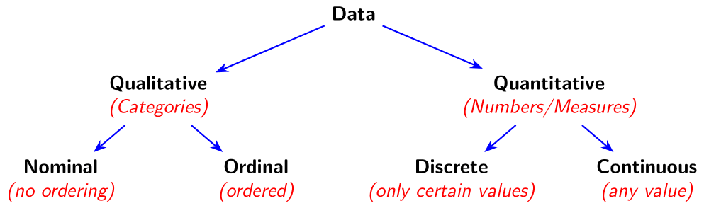

# What is Data?

```{r setup, include=FALSE}
#library(webexercises)
```

As we begin our journey to becoming Data Scientists, it is important to get a firm grasp of what data actually is. There are many ways to define data. If you were to look at the origin of the word, you would see that it is the plural of the Latin word "datum", which means piece of information. You might propose other definitions, such as: Information collected about something, or Facts and Statistics used to calculate something. All of these are acceptable interpretations of data, and we will probably switch between them throughout the semester. But, it is important to acknowledge that data (the individual pieces of information) by itself is essentially meaningless, it is through interpretation that it gains meaning. And that is what we will learn throughout this semester; how to interpret pieces of information to tell a story. Data itself does not answer questions, it only becomes useful once we decide what question we are asking.

::: learning-goals
-   Understand what data is, how it’s collected, and why interpretation gives it meaning.
-   Recognize the role of data science in modeling, storytelling, and decision-making.
-   Classify data as quantitative or qualitative, and further distinguish between continuous, discrete, nominal, and ordinal types.
:::

::: callout-tip
## Supplemental Material

<a href="Reading-Guide/L1-Reading-Guide.pdf" download> 📄 Download the lecture's Reading Guide </a>
:::

## Data-fication

Technology has become an integral part of our daily life. Almost everything we do tracks and collects data on us. This includes checking our social media in the morning, purchasing food with our credit card, and even "scanning" our ID to enter buildings. Every company we interact with collects data on us whether we like it or not, including the Government. It should be mentioned that not all of this is bad, as sometimes we willingly trade data for convenience, such as using GPS navigation. The school collects information about what classes you have passed, credit card companies collect information to determine how reliable you are in paying your bills, and hospitals collect medical history about you to improve your level of care.

::: callout-note
## Reflection

Before reading on, you should stop and think about what information about you is out there.

-   Can you think of specific companies/groups which have a lot of data about you?
-   Do you think it is a good or bad thing that information about you is collected?
:::

Because of the large amount of data that is floating around in the "wild", scientists say that we are currently in the "Age of Information/Data". Another term, coined in a 2013 article titled "The Rise of Big Data", describes the process of "taking all aspects of life and turning them into data \[$\dots$\] Once we datafy things, we can transform their purpose and turn the information into new forms of value." This results in a “digital footprint”; as we leave a trail of data about ourselves wherever we go. This digital footprint starts when we are born and follows us throughout our lives. Companies are able to change/tweak products based on the data they collect about our preferences (think how social media evolved based on the apps we used), but these products can also change how we behave (think social media addiction).

::: {.callout-tip title="Try it Out"}
Emmit is a college sophomore who starts every day by checking his phone, grabbing a breakfast burrito at the cafeteria, and hiking to the Grotto on campus. What types of data are being generated by Emmit’s morning routine? Who might collect that data, and what could they use it for?

<details>

<summary>Click to see the solution</summary>



</details>
:::

## Communicating with Data

So all of this data is available, but why should we care exactly? Well, all of this data allows us to do some pretty cool things. In the previous section, we mentioned how credit card companies can determine if we are dependable. They do this by taking our past payment history and other information about us, such as age, gender, and income level, and then building a model to decide if we will end up paying off the loan or defaulting on it. Other scenarios might be to predict the outcomes of NFL games, analyze weather patterns to better understand hurricane trajectory, or even recommend movies on Netflix/products on Amazon. All of these things are done with data, and when we build these models we are doing Data Science. There are many definitions out there for Data Science, but one of the ones I like is the following: **Data Science unlocks hidden stories within vast amounts of data, paving the way for innovations that transform industries and improve lives.**

Since Data Science involves the process of unlocking and telling stories, it is important for us to ask ourselves what exactly makes a good story. In middle school and high school, I am sure we were taught that every story should have a beginning (the Introduction), a middle (the "Plot"), and an ending (the Conclusion). As Data Scientists, we will need to communicate our results in a similar way (as a data story) in order for people to understand our findings. So, we should also start to think about how we convey a data story so other people can understand it. If we are predicting the miles per gallon a car will have, then we will present our story differently to kindergartners than we would to automotive experts. The results stay the same, but the language, visuals, and level of detail change based on who needs to understand the story. So, it is important to write our story with our audience in mind. To help the presentation, we will want to incorporate visualizations to engage the audience and support our plot.

::: {.callout-tip title="Try it Out"}
Emmit and his friends have been complaining that the campus dining hall lines are way too long during lunch. Emmit decides to track how long he waits each day for a week, and also asks his friends to do the same. He collects data on wait times, day of the week, and time of day. How can Emmit turn this data into a compelling story? Who is his audience, and what would be a good way to visualize his findings?

<details>

<summary>Click to see the solution</summary>



</details>
:::

## Classifying Data

There are a number of ways to classify the data that we will encounter throughout this course. The first big division will be deciding whether the data is **Quantitative** or **Qualitative**. Quantitative data are anything that is a count or a measure (think quantities) while Qualitative data are things that cannot be expressed using numbers (think categories). The format of the data (numbers or words) does not determine its type — what matters is whether arithmetic operations make sense. Depending on what type of data we have will determine how we analyze and visualize it.

Quantitative data can be broken up into two more categories. We will say the data is **Continuous** if it can take on infinitely many values in a given interval. What this essentially means is that if it makes sense to add additional decimal places then it is probably continuous data. Examples of this include temperature (it makes sense for something to be 74.3$^\circ$ F or even 74.3138$^\circ$ F if our measurement device is precise enough), weight, and time. We need to be careful, as continuous data does not mean that it is continuously changing, it means that it can take any value in an interval.

::: callout-warning
Just because a value has decimals doesn’t mean it’s continuous! Think about whether additional precision makes sense.
:::

The other type of quantitative data will be **Discrete** data. If our data can only take on certain values in a given interval then it will be Discrete data. This includes the number of people at a party (it has to be a whole number as we can't have a fraction of a person), a person's shoe size, and the amount of money they have in their wallet. Notice that some of these may have decimal places, like shoe size, but still be considered discrete data since it does not make sense to have an additional decimal place. Even though we can have 9.5 or 10.5, we cannot meaningfully add another decimal (like 9.53) — the set of allowed values is fixed. One mistake students often make is saying that there is a finite number of possibilities for discrete data. This is false, there can be an infinite number of values (theoretically there be $0, 1, 2, 3, \cdots$ all the way to infinity number of people in a room, but it has to be a whole number) as long as the data can only take on certain values in the interval.

Qualitative (categorical) data can also be broken up into two groups. These groups depend on whether the data can be ordered or not. **Nominal** data has no implied ordering. Examples of this might be gender, color, or fruits as it does not make sense to say that one ordering is correct (it doesn't make sense to say male comes before female or vice versa). **Ordinal** data can be ordered. This might include grade classification (Freshman, Sophomore, Junior, Senior), letter grades, and drink sizes (small, medium, and large). All of these make sense to put in a specific order. Even though ordinal categories have an order, the differences between them are not necessarily equal, so arithmetic operations usually do not make sense.

Throughout the course, before we start analyzing data it is important to stop and think about what type of data we have. You will need to differentiate whether it us Qualitative or Quantitative. If it is Quantitative then is it Continuous or Discrete. If it is Qualitative then is it Nominal or Ordinal. For instance, we might say that it is Quantitative Continuous or Qualitative Nominal. We will never mix the classifications, for instance, we will never have Qualitative Discrete or Quantitative Ordinal Continuous, as this does not make sense. There are many additional ways we could classify our data, but we will just stick with these basic classifications for now.

{fig-align="center"}

::: {.callout-tip title="Try it Out"}
Emmit is organizing a spreadsheet of his week to track habits and mood. Help classify each of Emmit’s variables as Quantitative Continuous, Quantitative Discrete, Qualitative Nominal, or Qualitative Ordinal:

-   Sleep hours
-   Number of texts sent
-   Mood (happy, okay, sad)
-   Year in college

<details>

<summary>Click to see the solution</summary>



</details>
:::

::: {.chapter-resources}

<div class="chapter-resources-header">
  <a href="https://youtu.be/OWjad0IHfns" target="_blank">Lecture Video</a>
</div>

<div class="chapter-resources-grid">
  <div><a href="Assignments/Data-200-L1-Inclass-Assignment.pdf" target="_blank">In-Class Exercises</a></div>
  <div><a href="https://youtu.be/k_2wGKdOXeA" target="_blank">In-Class Exercises Video Solutions</a></div>
</div>

<div class="chapter-resources-footer lab-row">
  <a href="Assignments/Data-200-L1-Lab.pdf" target="_blank">Lab Problems</a>
</div>

<div class="chapter-resources-footer problem-set-row">
  <a href="Assignments/Data-200-L1-Problem-Set.pdf" target="_blank">Problem Set Questions</a>
</div>

:::